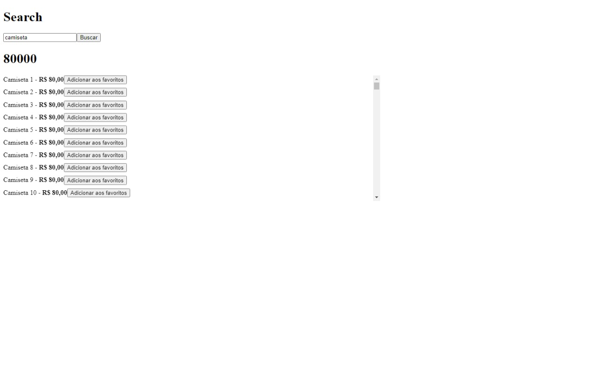
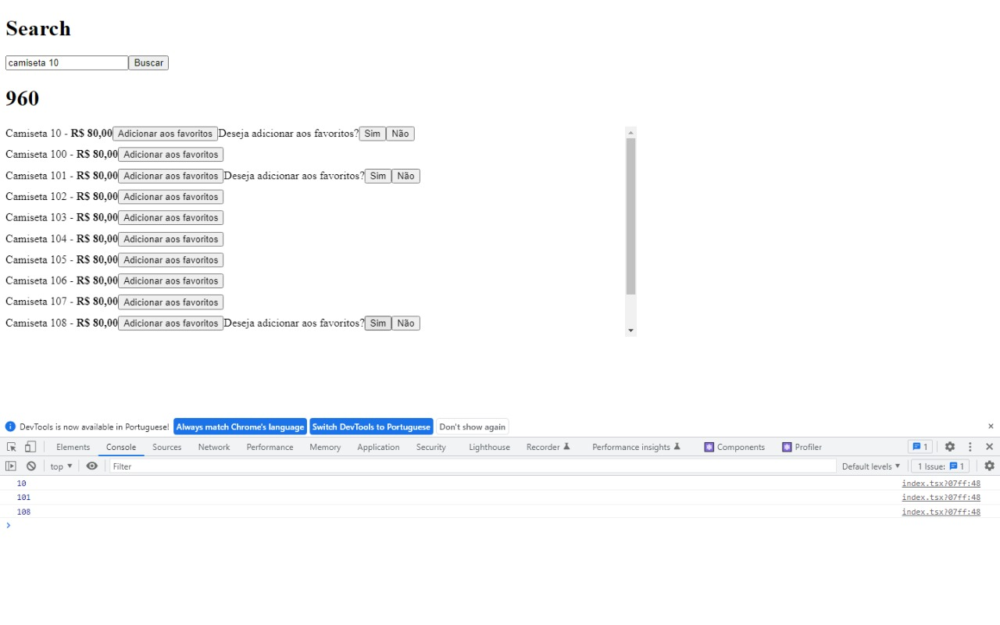

<div>
  <h1 align="center"> 
    Perfreact
  </h1>
  <h2 align="center"> 
  Performing apps with ReactJS
  </h2>
  <h3 align="center"> 
    Module 5 - RocketSeat -  Ignite ReactJS 🔥
  </h3>

  <p align="center">
    <a href="https://rocketseat.com.br">
      
    </a>
    <a href="https://github.com/jorgeeder"> 
      
    </a>
    
    
    <a href="https://opensource.org/licenses/MIT">
      
    </a>
  </p>
</div>

## About The Project

Application to study how to improve the performance of applications made with ReactJS, understanding how the library's internal algorithms work and the entire component rendering flow.


## Features

- Fetch items
- List items
- Sum the value of the searched items
- Print to console selected item


## Technologies

-   **[ReactJS](https://reactjs.org/)**


## Application in Use






## Requirement

-   **[Node.js](https://nodejs.org/)**


## Running The Project

```

# You can use npm package manager or yarn to run the commands below

## Clone the repository
git clone https://github.com/jorgeeder/perfreact

## Access the project folder in the terminal
cd perfreact

## Download project dependencies
yarn # or npm install

## Run the project
yarn dev  # or: npm run dev

## Run the server
yarn server  # or: npm run server

## Access in the browser http://localhost:3000

```
## License

This project is under the MIT license. See the [LICENSE](/LICENSE) file for more details.


<div align="center">
  <p> Made with 💜 by <a href="https://github.com/jorgeeder">Jorge Eder</a> </p>
  <p>
    <a href="https://www.linkedin.com/in/jorgeeder/">
      
    </a>
    <a href = "mailto:jorgeeder.dev@gmail.com">
      
    </a>
  </p>
</div>